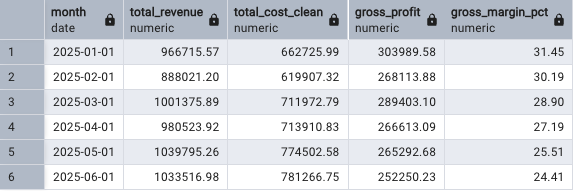
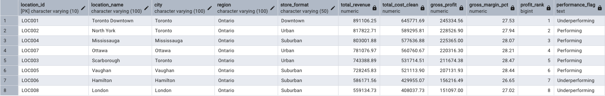
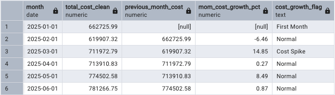

# Operations Profitability & Cost Optimization

## Project Overview

This project analyzes restaurant operations data to identify profitability drivers, cost inefficiencies, and opportunities to improve margins.

The analysis follows a structured workflow:

1. Data validation
2. Clean data preparation
3. SQL-based analysis
4. Business insights and recommendations

---

## Business Objective

The goal of this project is to answer:

**Where is profitability being lost, why is it happening, and what actions should the business prioritize?**

Key focus areas:

* Revenue and profitability trends
* Cost growth by month, product, and location
* Waste and operational inefficiencies
* Margin improvement opportunities
* Data quality and reconciliation issues

---

## Tools Used

* PostgreSQL
* pgAdmin
* SQL
* Python
* pandas
* Jupyter Notebook
* GitHub

---

## Project Structure

```
sql/
├── 01_create_tables.sql
├── 00_data_validation_checks.sql
├── 02_validation_outputs.sql
├── 02_monthly_profitability.sql
├── 03_location_performance.sql
└── 04_mom_cost_growth.sql

notebooks/
└── 01_data_validation.ipynb

data/
└── cleaned/
    └── validation_summary.csv

outputs/
├── validation_results_final.csv
├── monthly_profitability.csv
├── location_performance.csv
└── mom_cost_growth.csv

images/
├── validation_failures.png
├── validation_summary.png
├── monthly_profitability.png
├── location_performance.png
└── mom_cost_growth.png
```

---

## Data Quality Validation Framework

A SQL validation framework was created before analysis to ensure data reliability.

Validation checks covered:

* Missing values
* Duplicate records
* Negative values
* Orphan keys
* Date and month consistency
* Sales-to-cost join coverage
* Category consistency
* Cost and percentage reconciliation checks

---

## Validation Findings

Core structural checks passed successfully.

Two reconciliation issues were identified:

* `cost_components_not_equal_total_cost` (553 rows, high severity)
* `vendor_cost_change_pct_mismatch` (139 rows, medium severity)

These issues indicate calculation inconsistencies, not structural failures.

---

## Data Quality Decision

The dataset is reliable for analysis.

However:

* `total_cost` was recalculated using cost components
* `cost_change_pct` was recalculated from unit costs

All downstream analysis uses cleaned fields.

---

## Monthly Profitability Analysis

### Method

* Aggregated sales data at month, location, and product level
* Recalculated `total_cost_clean`
* Joined sales and cost datasets
* Calculated:

  * Gross Profit
  * Gross Margin %

### Key Findings

* Revenue remained stable between **$888K–$1.04M**
* Gross margin declined from **31.45% → 24.41%**
* Profit decreased despite stable revenue

### Business Interpretation

Profitability decline is driven by **rising operational costs**, not falling sales.

### Output

`outputs/monthly_profitability.csv`



---

## Location Performance Analysis

### Method

* Aggregated revenue and cost by location
* Calculated profit and margin
* Ranked locations by profit
* Flagged below-average margin locations

### Key Findings

* **Toronto Downtown** generates highest profit but lower efficiency
* Several locations show stable performance
* **Hamilton and London** underperform in both profit and margin

### Business Interpretation

* High-performing locations still have cost optimization opportunities
* Underperforming locations require operational improvements

### Output

`outputs/location_performance.csv`



---

## Month-over-Month Cost Growth

### Method

* Aggregated monthly clean cost
* Used SQL `LAG()` to calculate prior month cost
* Computed cost growth %
* Flagged spikes above 10%

### Key Findings

* **March cost spike: +14.85%**
* Other months show normal variation

### Business Interpretation

The spike suggests potential issues such as:

* Vendor price increases
* Labor or overhead changes
* Operational inefficiencies

### Output

`outputs/mom_cost_growth.csv`



---

## Key Insights

* Profitability decline is driven by **cost increases, not revenue loss**
* Margins are compressing across time
* Some high-profit locations are inefficient
* Cost spikes can significantly impact performance

---

## Recommendations

### High Priority

* Investigate March cost spike drivers
* Audit cost structure in high-revenue locations

### Medium Priority

* Optimize labor and overhead allocation
* Improve vendor cost monitoring

### Low Priority

* Review pricing strategy if margin compression continues

---

## Senior-Level Capabilities Demonstrated

* Data validation framework implementation
* SQL-based analytical modeling
* Use of window functions (`LAG`)
* Clean vs raw data handling
* Business-driven insights
* Structured and reproducible workflow

---

## Current Status

* [x] Database schema created
* [x] SQL validation framework created
* [x] Validation results saved
* [x] Validation screenshots created
* [x] Validation summary exported with Python
* [x] Validation findings documented
* [x] Monthly profitability analysis
* [x] Location performance analysis
* [x] Cost growth analysis
* [ ] Dashboard
* [ ] Final business recommendations
